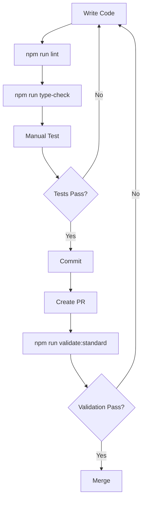
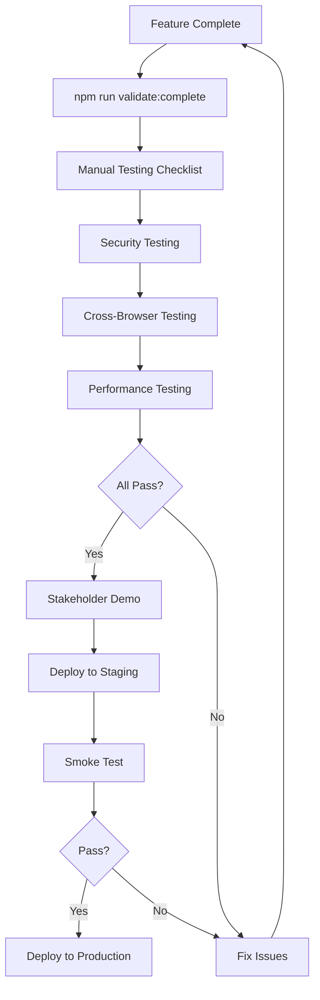

# Frontend Quality Assurance - Complete Documentation Index

**Version:** 1.0
**Last Updated:** 2026-02-17
**Status:** Production Ready ✅

---

## 📚 Documentation Overview

This is your complete frontend quality assurance system. All documents are designed to work together to ensure the highest quality frontend for PatchIQ.

---

## 🎯 Start Here

### For Developers (Daily Use)
👉 **[FRONTEND-QA-QUICK-REFERENCE.md](./FRONTEND-QA-QUICK-REFERENCE.md)**
- Quick commands and cheatsheet
- 2-page reference card
- Use this for daily development

### For QA Team (Manual Testing)
👉 **[FRONTEND-MANUAL-TESTING-CHECKLIST.md](./FRONTEND-MANUAL-TESTING-CHECKLIST.md)**
- Complete manual testing checklist
- Printable format
- Use for pre-release testing

### For Team Leads (Planning & Process)
👉 **[FRONTEND-QUALITY-ASSURANCE-PLAN.md](./FRONTEND-QUALITY-ASSURANCE-PLAN.md)**
- Comprehensive QA strategy (50+ pages)
- All testing workflows
- Reference documentation

---

## 📖 Document Descriptions

### 1. FRONTEND-QA-QUICK-REFERENCE.md
**Purpose:** Daily reference card for developers
**Length:** 2 pages
**Use Cases:**
- Quick command lookup
- Pre-commit checklist
- Common troubleshooting

**Key Sections:**
- ⚡ Quick Commands
- 🧪 Testing Commands
- 🔒 XSS Test Payloads
- 📋 Manual Testing Checklist
- 🚨 Common Issues

---

### 2. FRONTEND-MANUAL-TESTING-CHECKLIST.md
**Purpose:** Complete manual testing checklist
**Length:** 20+ pages
**Use Cases:**
- Pre-release testing
- Stakeholder demos
- Regression testing

**Key Sections:**
- ✅ All feature tests with checkboxes
- 🔒 Security testing (XSS, validation)
- 📱 Responsive testing
- 🌐 Cross-browser testing
- ♿ Accessibility testing
- ⚡ Performance testing
- ✍️ Sign-off section

---

### 3. FRONTEND-QUALITY-ASSURANCE-PLAN.md
**Purpose:** Comprehensive QA strategy and reference
**Length:** 50+ pages
**Use Cases:**
- QA process documentation
- Onboarding new team members
- Process improvement

**Key Sections:**
- 🎯 Validation Levels (Quick/Standard/Complete)
- 🤖 Automated Testing Strategy
- 👤 Manual Testing Procedures
- 🔒 Security Testing Protocols
- ⚡ Performance Testing
- ♿ Accessibility Guidelines
- 🌐 Cross-Browser Matrix
- 📊 Code Quality Standards
- 🔄 CI/CD Integration
- ✅ Pre-Release Checklist
- 🔧 Maintenance Workflows
- 📈 Metrics & KPIs

---

## 🚀 Quick Start Guide

### First Time Setup

```bash
# 1. Navigate to frontend directory
cd frontend

# 2. Verify all scripts are executable
ls -la scripts/*.sh

# 3. Run quick validation to verify setup
npm run validate:quick
```

### Daily Workflow

```bash
# Morning: Start development
cd frontend
npm run dev

# During: Before each commit
npm run lint
npm run type-check
# Manually test your changes

# Evening: Before pushing
npm run validate:quick
```

### Before Creating PR

```bash
cd frontend
npm run validate:standard  # 30-45 minutes
```

### Before Release

```bash
cd frontend
npm run validate:complete  # 2-3 hours

# Then complete manual testing checklist
# See: FRONTEND-MANUAL-TESTING-CHECKLIST.md
```

---

## 🛠️ Available Tools

### NPM Scripts

| Script | Purpose | Time | When |
|--------|---------|------|------|
| `npm run validate:quick` | Quick validation | 5-10 min | Every commit |
| `npm run validate:standard` | Standard validation | 30-45 min | Every PR |
| `npm run validate:complete` | Complete validation | 2-3 hours | Every release |
| `npm run validate:security` | Security audit | 10-15 min | Before release |
| `npm run validate:critical-path` | Core features only | 15-20 min | Smoke test |

### Shell Scripts (in `frontend/scripts/`)

| Script | Description |
|--------|-------------|
| `quick-validation.sh` | Lint + TypeScript + Build |
| `standard-validation.sh` | Quick + Critical tests |
| `complete-validation.sh` | Full validation suite |
| `security-tests.sh` | Security audit + checks |
| `critical-path-tests.sh` | Core feature tests |

---

## 🎯 Validation Levels Explained

### Level 1: Quick Validation (5-10 minutes)
**What it does:**
- ✅ ESLint code quality check
- ✅ TypeScript type checking
- ✅ Production build test

**When to use:**
- Before every commit
- During active development
- Quick sanity check

**Command:**
```bash
npm run validate:quick
```

---

### Level 2: Standard Validation (30-45 minutes)
**What it does:**
- ✅ All Level 1 checks
- ✅ Critical path E2E tests
- ✅ Security tests
- ✅ Bundle size analysis

**When to use:**
- Before creating PR
- After major changes
- Before merging to main

**Command:**
```bash
npm run validate:standard
```

---

### Level 3: Complete Validation (2-3 hours)
**What it does:**
- ✅ All Level 2 checks
- ✅ Full E2E test suite
- ✅ Dependency audit
- ✅ Performance analysis
- ✅ Coverage report

**When to use:**
- Before releases
- After major refactoring
- Monthly quality review

**Command:**
```bash
npm run validate:complete
```

---

## 🔒 Security Testing

### Automated Security Tests

```bash
npm run validate:security
```

This runs:
- Playwright form validation tests
- npm audit for vulnerable dependencies
- Code scan for hardcoded secrets
- Console statement detection

### Manual XSS Testing

**Required before every release!**

Test these payloads in ALL input fields:

```html
<script>alert('XSS')</script>

<svg/onload=alert('XSS')>
```

**Critical forms to test:**
1. Add Asset → Asset Name
2. Create Patch → Description
3. Add User → Name, Email
4. Schedule Report → Recipients

**Expected:** All payloads sanitized/blocked

See: `FRONTEND-MANUAL-TESTING-CHECKLIST.md` for complete security checklist

---

## 🧪 Testing Strategy

### Automated Testing (Playwright)

```bash
# All tests
npm test

# Specific phase
npm test -- e2e/phase4-*.spec.ts

# By feature
npm test -- e2e/phase4-agent31-form-validation.spec.ts

# Interactive mode
npm run test:ui
```

### Test Organization

```
e2e/
├── phase1-*.spec.ts    # Core CRUD (Assets, Patches, Users)
├── phase2-*.spec.ts    # Deployments, Recommendations
├── phase3-*.spec.ts    # Discovery, Jobs, Notifications
└── phase4-*.spec.ts    # Security, UX, Polish
```

### Manual Testing

Use the complete checklist:
👉 **[FRONTEND-MANUAL-TESTING-CHECKLIST.md](./FRONTEND-MANUAL-TESTING-CHECKLIST.md)**

Includes:
- ✅ 200+ test cases
- ✅ Security testing section
- ✅ Cross-browser checklist
- ✅ Accessibility audit
- ✅ Performance benchmarks
- ✅ Sign-off section

---

## 📊 Quality Metrics

### Current Status

| Metric | Target | Current | Status |
|--------|--------|---------|--------|
| ESLint Errors | 0 | 0 | ✅ |
| TypeScript Errors | 0 | 0 | ✅ |
| XSS Vulnerabilities | 0 | 0 | ✅ |
| Bundle Size | < 2MB | TBD | - |
| Test Pass Rate | 100% | TBD | - |

### Quality Gates

**Before Commit:**
- ✅ Zero ESLint errors
- ✅ Zero TypeScript errors
- ✅ Manual test your changes

**Before PR:**
- ✅ All automated tests passing
- ✅ Code reviewed
- ✅ No console.log statements
- ✅ Performance impact assessed

**Before Release:**
- ✅ Complete validation passing
- ✅ Security audit clean
- ✅ Cross-browser tested
- ✅ Manual testing complete
- ✅ Stakeholder approval

---

## 🔄 Workflows

### Development Workflow



### Release Workflow



---

## 🎓 Training Resources

### For New Developers

1. Read: `FRONTEND-QA-QUICK-REFERENCE.md` (15 min)
2. Run: `npm run validate:quick` (10 min)
3. Practice: Manual XSS testing (15 min)
4. Review: Common issues section (10 min)

**Total time:** 1 hour

### For QA Engineers

1. Read: `FRONTEND-QUALITY-ASSURANCE-PLAN.md` (1 hour)
2. Review: `FRONTEND-MANUAL-TESTING-CHECKLIST.md` (30 min)
3. Practice: Complete manual testing (2 hours)
4. Run: All validation scripts (3 hours)

**Total time:** 1 day

### For Team Leads

1. Review: All documentation (2 hours)
2. Run: Complete validation workflow (3 hours)
3. Customize: For your team's needs (2 hours)
4. Train: Team members (4 hours)

**Total time:** 2 days

---

## 🐛 Common Issues & Solutions

### Issue: ESLint Errors

**Solution:**
```bash
npm run lint:fix  # Auto-fix most issues
```

### Issue: TypeScript Errors

**Solution:**
```bash
npm run type-check  # See all errors
# Fix manually - no auto-fix for types
```

### Issue: Tests Failing

**Solution:**
```bash
npm run test:ui     # Debug in interactive mode
npm run test:debug  # Step through test
```

### Issue: Bundle Too Large

**Solution:**
```bash
npm run build
du -sh dist  # Check size
# Analyze chunks and optimize imports
```

### Issue: XSS Vulnerability Found

**Solution:**
1. Identify the vulnerable form field
2. Apply sanitization: `import { sanitizeHTML } from '@/utils/sanitize'`
3. Wrap input: `sanitizeHTML(userInput)`
4. Re-test with XSS payloads
5. Run: `npm run validate:security`

---

## 📞 Support & Escalation

### Bug Severity Levels

| Level | Response | Example |
|-------|----------|---------|
| **P0** | Immediate | Security breach, app crash |
| **P1** | 24 hours | Major feature broken |
| **P2** | 1 week | Minor feature broken |
| **P3** | Backlog | Cosmetic issue |

### Where to Get Help

- **Quick questions:** `FRONTEND-QA-QUICK-REFERENCE.md`
- **Process questions:** `FRONTEND-QUALITY-ASSURANCE-PLAN.md`
- **Testing help:** `FRONTEND-MANUAL-TESTING-CHECKLIST.md`
- **Project docs:** `CLAUDE.md`

---

## 🔗 Related Documentation

### Internal Docs
- `CLAUDE.md` - Project conventions
- `backend/src/CONVENTIONS.md` - Backend architecture
- `docs/sprint-0/ROADMAP.md` - Project roadmap
- `PHASE4-COMPLETION-REPORT.md` - Latest QA status

### External Resources
- [React Documentation](https://react.dev)
- [Ant Design](https://ant.design)
- [Playwright](https://playwright.dev)
- [OWASP Top 10](https://owasp.org/www-project-top-ten/)

---

## ✅ Implementation Checklist

### Phase 1: Setup (Completed ✅)
- [x] Created comprehensive QA plan
- [x] Created quick reference card
- [x] Created manual testing checklist
- [x] Created validation scripts
- [x] Updated package.json with npm scripts
- [x] Made scripts executable

### Phase 2: Validation (Next Steps)
- [ ] Run complete validation
- [ ] Execute manual testing checklist
- [ ] Document baseline metrics
- [ ] Train team on new process

### Phase 3: Integration
- [ ] Add CI/CD integration
- [ ] Set up automated reporting
- [ ] Create Slack notifications
- [ ] Integrate with issue tracker

### Phase 4: Optimization
- [ ] Measure and improve test execution time
- [ ] Add more automated tests
- [ ] Refine quality metrics
- [ ] Continuous improvement

---

## 📈 Success Metrics

### Adoption Metrics
- [ ] 100% of commits run quick validation
- [ ] 100% of PRs run standard validation
- [ ] 100% of releases run complete validation
- [ ] 100% of releases complete manual checklist

### Quality Metrics
- [ ] Zero ESLint errors maintained
- [ ] Zero TypeScript errors maintained
- [ ] Zero P0 bugs in production
- [ ] < 5 P1 bugs per release
- [ ] Test coverage > 70%

---

## 🎯 Next Steps

### Immediate (Today)
1. ✅ Read `FRONTEND-QA-QUICK-REFERENCE.md`
2. ✅ Run `npm run validate:quick`
3. ✅ Verify all scripts work

### This Week
1. [ ] Run `npm run validate:standard` on current code
2. [ ] Complete manual testing checklist once
3. [ ] Train team on new process
4. [ ] Establish baseline metrics

### This Month
1. [ ] Run complete validation before next release
2. [ ] Integrate into CI/CD
3. [ ] Review and refine process
4. [ ] Measure improvements

---

## 📝 Changelog

### Version 1.0 (2026-02-17)
- ✅ Initial release
- ✅ Complete QA plan (50+ pages)
- ✅ Quick reference card
- ✅ Manual testing checklist
- ✅ Validation scripts
- ✅ NPM script integration

---

## 🙏 Acknowledgments

This comprehensive QA system was created to ensure the highest quality frontend for PatchIQ. It combines industry best practices with project-specific requirements.

**Created:** 2026-02-17
**Authors:** Engineering Team + Claude Sonnet 4.5
**Maintained by:** Frontend Team

---

**Document Owner:** Engineering Team
**Review Frequency:** Monthly
**Next Review:** 2026-03-17

---

## 🎊 You're All Set!

Your frontend now has a world-class QA system. Start with:

```bash
cd frontend
npm run validate:quick
```

Then explore the other documents as needed. Happy testing! 🚀
